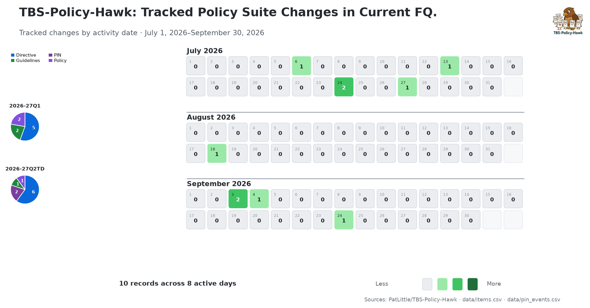

<!-- policy-hawk:banner -->

# Policy Evolution 2026-27 Q2

**Period covered:** 2026-07-01 to 2026-09-30  
**Source:** Auto-analysis comments added to TBS-Policy-Hawk issues.

This file compiles policy-change analysis comments for updates detected during the quarter. Entries are organized chronologically by the effective/update date in the issue GUID.
<!-- policy-hawk:latest-heatmap -->

---

## 2026-07-06 — Digital Talent, Directive on

**Issue:** [#261](https://github.com/PatLittle/TBS-Policy-Hawk/issues/261)  
**Document ID:** 32749  
**Category:** Directive  
**GUID:** `32749_2026-07-06`

### Policy change analysis

Compared the current captured version for `32749_2026-07-06` with the closest prior repository copy:

- New/current capture: `data/Directive/32749_2026-07-06/20260707T163905Z.md`
- Prior version used for comparison: `data/Directive/Digital Talent Directive on_2025-08-31.xml`

#### Summary

This update is a targeted procedural amendment to the mandatory procedures for digital talent sourcing. The main substantive change removes explicit reliance on the GC Digital Talent platform from two TBS-OCIO interaction points and instead states the requirement in platform-neutral terms.

#### Substantive changes identified

| Section | Prior version | New/current version | Interpretation |
|---|---|---|---|
| **A.2.5.1.1** | Required managers/delegated authorities to check TBS-OCIO-led centralized talent recruitment and talent management pools **using the GC Digital Talent platform** before launching department-specific recruitment or initiating a digital services contract. | Requires checking TBS-OCIO-led centralized talent recruitment and talent management pools, but no longer names the GC Digital Talent platform. | The obligation to verify available centralized talent remains, but the channel is now technology-neutral and no longer tied to a named platform. |
| **A.2.5.4.2** | Directed managers/delegated authorities to follow instructions on the GC Digital Talent Platform to complete and submit the Digital Services Contracting Questionnaire. | Requires completion and submission of the Digital Services Contracting Questionnaire directly to TBS-OCIO when qualifying procurements are submitted to contracting authorities, and links to the questionnaire document. | The questionnaire requirement remains, but the process is reframed around direct submission to TBS-OCIO rather than platform-based instructions. |
| **A.2.5.4.3** | Required confirmation with TBS-OCIO **using the GC Digital Talent Platform** that no available pre-qualified talent in a TBS-OCIO-coordinated pool could meet the need before relying on a talent shortage as the rationale for contracting out. | Requires confirmation with TBS-OCIO that no available pre-qualified talent in a TBS-OCIO-coordinated pool could meet the need in the timeframe provided, without specifying the platform. | The pre-contracting confirmation obligation remains, but the specified confirmation mechanism has been removed. |

#### Practical effect

1. **Platform-neutral compliance:** Departments still need to check centralized digital talent pools and engage TBS-OCIO, but the directive no longer makes the GC Digital Talent platform the explicit route for those steps.
2. **Procurement questionnaire retained:** The Digital Services Contracting Questionnaire remains mandatory for contracts, amendments and task authorizations that exceed $40,000 and align with the cited procurement procedures.
3. **Contracting-out rationale still constrained:** Managers and delegated authorities must still confirm with TBS-OCIO that suitable pre-qualified talent is unavailable before citing talent shortage as the primary reason to contract out.

#### Non-substantive changes

Most remaining differences appear to be formatting, link rendering, punctuation spacing, and conversion differences between the prior HTML/XML capture and the current markdown capture.

#### Watch item

Because the named GC Digital Talent platform references were removed rather than replaced with a specific alternate workflow, departments may need operational guidance from TBS-OCIO on the current channel for pool checks, questionnaire submission, and pre-qualified talent confirmation.

---

## 2026-07-07 — Removed from hierarchy: GC Digital Talent Platform

**Issue:** [#264](https://github.com/PatLittle/TBS-Policy-Hawk/issues/264)
**Document ID:** 32750
**Category:** Hierarchy
**GUID:** `hierarchy_removed_32750_2026-07-07`
**Change type:** hierarchy_removed

### Policy change analysis

Compared the current hierarchy-removal capture for `hierarchy_removed_32750_2026-07-07` with the closest prior repository hierarchy snapshot:

- New/current capture: `data/Hierarchy/hierarchy_removed_32750_2026-07-07/20260707T231942Z.md`
- Current hierarchy source: `data/tbs_policy_hierarchy_full.csv`
- Prior version used for comparison: `data/tbs_policy_hierarchy_full.csv` from commit `2b3d38b^`

#### Summary

This is a hierarchy-tree removal for the GC Digital Talent Platform entry, not a full removal of the public page content. The removed hierarchy row had placed document `32750` as a level-4 child under `Directive on Digital Talent`; the captured page still resolves as a sparse GC Digital Talent Platform page with a 2023-04-04 page date.

#### Substantive changes identified

| Area | Evidence before / previous state | Evidence now | Interpretation |
|---|---|---|---|
| **Hierarchy path** | `GC Digital Talent Platform` appeared at minimum level 4 under `Values and Ethics Code for the Public Sector > Foundation Framework for Treasury Board Policies > Service and Digital, Policy on > Digital Talent, Directive on`. | Document `32750` no longer appears in `data/tbs_policy_hierarchy_full.csv`; `data/new_items.csv` records `hierarchy_removed_32750_2026-07-07` as `hierarchy_removed`. | The platform has been removed from the TBS policy hierarchy tree as a child/supporting item under the Directive on Digital Talent. |
| **Public page state** | Prior hierarchy metadata linked to `https://www.tbs-sct.canada.ca/pol/doc-eng.aspx?id=32750`. | The current capture still shows a standalone `GC Digital Talent Platform` page with minimal content and no substantive policy requirements. | The evidence supports hierarchy removal, but not complete retirement of the public URL. |
| **Related policy context** | The previous Directive on Digital Talent text explicitly referenced the GC Digital Talent platform in talent-pool checks, questionnaire submission, and pre-qualified talent confirmation. | Issue #261's 2026-07-06 directive update removed those named platform references and made the relevant procedures platform-neutral or direct-to-TBS-OCIO. | The hierarchy removal is consistent with the directive no longer presenting the platform as the named procedural channel. |

#### Practical effect

1. **Hierarchy cleanup:** The GC Digital Talent Platform no longer appears as a level-4 policy hierarchy item under the Directive on Digital Talent.
2. **Operational dependency reduced:** Together with the July 6 directive amendment, the policy suite no longer points departments to this named platform as the explicit route for key digital talent sourcing steps.
3. **Standalone page still visible:** Because the captured page still resolves, departments should not infer from this evidence alone that the platform URL or service has been fully decommissioned.

#### Non-substantive changes

The capture includes ordinary Canada.ca page chrome and duplicate date-modified footer content. Those elements were not treated as policy hierarchy changes.

#### Watch item

Watch for TBS-OCIO guidance or further site updates that clarify the current operational channel replacing former GC Digital Talent Platform instructions.

---

## 2026-07-13 — Transfer Payments, Directive on

**Issue:** [#265](https://github.com/PatLittle/TBS-Policy-Hawk/issues/265)
**Document ID:** 14208
**Category:** Directive
**GUID:** `14208_2026-07-13`
**Change type:** policy_update

### Policy change analysis

Compared the current captured version for `14208_2026-07-13` with the closest prior repository copy:

- New/current capture: `data/Directive/14208_2026-07-13/20260713T235223Z.html`
- Current markdown capture: `data/Directive/14208_2026-07-13/20260713T235223Z.md`
- Prior version used for comparison: `data/Directive/Transfer Payments Directive on_2025-08-31.xml`
- Excluded capture: `data/Directive/Transfer Payments Directive on_2026-07-13.xml` because it contains a request-rejected page rather than policy content.

#### Summary

No substantive policy text changes were identified. The enriched current HTML capture and the prior repository copy both produced 579 comparable policy-content blocks. The only aligned block difference was a spacing/rendering change in Appendix F, section 13, around the phrase "federal funding," and it does not alter the funding-agreement recognition requirement.

#### Substantive changes identified

None.

#### Non-substantive changes

| Area | Prior version | New/current version | Interpretation |
|---|---|---|---|
| **Appendix F, section 13** | "A provision for adequate recognition of the federal funding, with an option..." | "A provision for adequate recognition of the federal funding , with an option..." | This is a punctuation/link-rendering spacing artifact. The requirement itself is unchanged. |
| **Capture format** | The closest prior copy is an HTML/XML capture from August 31, 2025. | The enriched current capture includes normalized HTML and markdown artifacts from July 13, 2026. | Markdown line wrapping, links, emphasis, and list rendering created noisy raw diffs, but the underlying policy-content blocks are unchanged. |

#### Glossary and related data check

No glossary-specific added, removed, or changed item was associated with this issue in `data/new_items.csv`. The existing `data/policy_glossary.csv` rows for source `14208` therefore were not treated as part of the issue #265 policy-update change.

#### Practical effect

Departments should not need to change transfer-payment program design, terms and conditions, funding agreement provisions, or monitoring practices based on this detected update alone.

---

## 2026-07-24 — Management of Real Property, Directive on the

**Issue:** [#267](https://github.com/PatLittle/TBS-Policy-Hawk/issues/267)
**Document ID:** 32691
**Category:** Directive
**GUID:** `32691_2026-07-24`
**Change type:** policy_update

### Policy change analysis

Compared the current captured version for `32691_2026-07-24` with the closest prior repository copy:

- New/current capture: `data/Directive/32691_2026-07-24/20260725T014912Z.md`
- Prior version used for comparison: `data/Directive/Management of Real Property Directive on the_2025-08-31.xml`
- Excluded capture: `data/Directive/Management of Real Property Directive on the_2026-07-24.xml` because it contains a request-rejected page rather than policy content.

#### Summary

This is a substantive redesign of the federal real-property disposal process to make housing the highest-priority public-purpose use. It introduces a mandatory housing-suitability assessment, creates separate disposal procedures for property intended and not intended for housing, changes appraisal thresholds and exceptions, and restructures due-diligence and heritage requirements.

#### Substantive changes identified

| Section | Prior version | New/current version | Interpretation |
|---|---|---|---|
| **4.2.7.2 and 4.2.26–4.2.28 — Disposal routing** | Required disposal of surplus property, notification and screening involving Canada Lands Company, and the general disposal/due-diligence process. | Requires practitioners to prioritize housing, notify Build Canada Homes so the Minister of Housing and Infrastructure can assess housing suitability, follow Appendix E if suitable and Appendix F if not, notify Public Services and Procurement Canada, and conduct disposal due diligence under Appendix D. | Every proposed disposal now enters a housing-suitability decision path before proceeding. Housing is expressly the first priority; other public purposes follow when property is not suitable for housing. |
| **Appendix E — Housing-development disposals** | No separate accelerated housing-disposal appendix existed. | Requires use of PSPC disposal services unless the responsible minister grants an exception; gives Build Canada Homes or Canada Lands Company on its behalf priority at net book value; and establishes contamination and valuation procedures for other housing recipients. | Creates a dedicated, centralized route intended to accelerate housing-supporting disposals, with special recipient and valuation rules. |
| **Appendix F — Other disposals** | Detailed disposal requirements were in 4.2.28–4.2.40, including CLC-specific screening criteria, public-purpose circulation, business cases, contamination controls and valuation rules. | Moves the non-housing process into Appendix F. It retains public-purpose circulation, ordered priority, business-case, contamination and valuation requirements, but no longer reproduces the former CLC screening criteria and confirmation steps. | Non-housing disposals retain core controls, while the former CLC-centred screening regime is replaced by the new housing/non-housing routing model. |
| **Appendix B.2.2.1 — Appraisals** | For non-competitive transactions, the estimate exception applied only to leases or licences below $25,000 total consideration. | Extends the exception to any transaction below $100,000. It also adds no-appraisal exceptions for net-book-value disposals to Build Canada Homes/CLC on its behalf and qualifying housing disposals to not-for-profits or Indigenous groups at not less than net book value. | Broadens the low-value estimate threshold and reduces appraisal requirements for specified housing transactions. |
| **Appendix D — Due diligence** | One disposal column generally required environmental condition, physical performance and market value; heritage value was “as appropriate.” Disposal consultation and notification duties were spread through section 4.2. | Separates housing and non-housing disposal columns. Several checks become “as appropriate” for housing disposals, heritage review becomes required for acquisitions and non-housing disposals, and disposal-specific legal, Indigenous-rights and official-languages steps are consolidated in D.2.2.2–D.2.2.5. | Due diligence is now tailored to the disposal path: the housing route is more flexible in several technical checks, while heritage review is strengthened for acquisitions and non-housing disposals and consultation duties remain explicit. |
| **Appendix A.2.2 — Heritage procedures** | Heritage evaluation and conservation procedures applied generally. | Exempts real-property disposals intended to support housing development from Appendix A’s mandatory procedures. | Housing-route disposals are not subject to the full Appendix A heritage process, although heritage value remains an “as appropriate” due-diligence consideration in Appendix D. |

#### Practical effect

1. **Mandatory housing screen:** Custodians must obtain a housing-suitability assessment before disposing of surplus real property.
2. **Centralized accelerated route:** Housing-suitable disposals normally use PSPC services and give Build Canada Homes/CLC acting for it priority at net book value.
3. **Changed valuation controls:** The non-competitive estimate threshold rises from $25,000 for leases/licences to $100,000 for all transaction types, with additional housing-specific appraisal exceptions.
4. **Two due-diligence standards:** Housing and non-housing disposals now carry different required-versus-as-appropriate checks.
5. **Consequential suite restructuring:** Reporting moves from Appendix C to G, barrier-free access from D to C, due diligence from E to D, and definitions from F to H.

#### Watch item

Implementation will depend on the process and timing used by Build Canada Homes and the Minister of Housing and Infrastructure to determine housing suitability, and on how departments apply the Appendix A heritage-procedure exemption alongside Appendix D’s remaining heritage consideration.

#### Classification

`scope-change`, `approval-change`, `threshold-change`, `administrative-cleanup`

---

## 2026-07-24 — Planning and Management of Investments, Policy on the

**Issue:** [#266](https://github.com/PatLittle/TBS-Policy-Hawk/issues/266)
**Document ID:** 32593
**Category:** Policy
**GUID:** `32593_2026-07-24`
**Change type:** policy_update

### Policy change analysis

Compared the current captured version for `32593_2026-07-24` with the closest prior repository copy:

- New/current capture: `data/Policy/32593_2026-07-24/20260725T014727Z.md`
- Prior version used for comparison: `data/Policy/32593_2026-06-01/20260603T202106Z.md`

#### Summary

This is a targeted housing-policy amendment to the parent investment policy. It creates a net-book-value exception to the usual market-value justification requirement for specified housing-suitable real property disposals, separates real-property and materiel due-diligence references, and updates the reporting-appendix reference to match the concurrently restructured real-property directive.

#### Substantive changes identified

| Section | Prior version | New/current version | Interpretation |
|---|---|---|---|
| **4.1.21 — Due diligence** | Required due diligence in the acquisition, disposal or divestment of real property and materiel, without naming the applicable procedures. | Requires real-property due diligence under Appendix D of the *Directive on the Management of Real Property* and points materiel acquisition/divestment to the *Directive on the Management of Materiel*. | The obligation is now routed to source-specific procedures. This is primarily a clarification and reference update, not removal of due diligence. |
| **4.1.22 — Market-value justification** | Required departments to justify consideration received or given against market value under Appendix B of the real-property directive. | Adds an exception for disposals of housing-suitable real property to Build Canada Homes, not-for-profits or Indigenous groups at a value not lower than net book value. | Specified housing disposals no longer need the usual market-value justification when the transaction meets the recipient and net-book-value conditions. |
| **4.1.25 — Proceeds-of-sale reporting** | Referred to Appendix C: Mandatory Procedures for Reporting. | Refers to Appendix G: Mandatory Procedures for Reporting. | This is a consequential cross-reference update following appendix renumbering in the amended real-property directive; the proceeds-of-sale condition remains. |

#### Practical effect

1. **Housing-disposal flexibility:** Departments can dispose of housing-suitable property to Build Canada Homes, not-for-profits or Indigenous groups without the usual market-value justification, provided the value is not below net book value.
2. **Procedure-specific due diligence:** Real-property and materiel transactions now point to their respective supporting instruments for due-diligence requirements.
3. **No change to proceeds-of-sale eligibility:** The reporting precondition remains, but its appendix reference moves from C to G.

#### Non-substantive changes

The remaining differences are link formatting and typography associated with the new capture. The Appendix C-to-G change is structural renumbering rather than a new reporting obligation.

#### Classification

`scope-change`, `approval-change`, `reference-update`

---

## 2026-07-27 — Management of Procurement, Directive on the

**Issue:** [#268](https://github.com/PatLittle/TBS-Policy-Hawk/issues/268)

**Document ID:** 32692

**Category:** Directive

**GUID:** `32692_2026-07-27`

**Change type:** policy_update

### Policy change analysis

Ran the issue enrichment workflow for issue #268 before analysis:

- Workflow run: `issue_enrich.yml` run `30596356316`
- New/current capture: `data/Directive/32692_2026-07-27/20260731T012803Z.md`
- Prior version used for comparison: `data/Directive/32692_2026-06-26/20260628T074628Z.md`

#### Summary

This is a targeted rescission in Appendix A. Section A.6 no longer assigns Public Services and Procurement Canada responsibility for procuring specified mission-oriented science and technology goods and services. No other visible policy clauses changed.

#### Substantive changes identified

| Section | Prior version | New/current version | Interpretation |
|---|---|---|---|
| **A.6 — Mandatory goods and services** | A.6.1 made Public Services and Procurement Canada responsible for procuring goods and services relating to mission-oriented science and technology requirements in the natural sciences and the human-science fields of urban, regional and transportation studies. | The section heading is now **“A.6 Rescinded”** and A.6.1 is absent from the visible policy text. The current HTML retains the former clause only inside a comment. | The directive no longer provides this specific assignment of procurement responsibility to PSPC. The evidence does not establish whether the responsibility was eliminated, delegated elsewhere, or moved to another authority or instrument. |

#### Practical effect

1. **Directive-level assignment removed:** Organizations can no longer rely on A.6.1 of this directive as the operative statement assigning these mission-oriented science and technology procurements to PSPC.
2. **Alternate authority may govern:** Departments handling procurements in the affected science and human-science fields should confirm the current service-delivery or delegation arrangement with PSPC rather than infer that the work has automatically devolved to departments.
3. **Otherwise unchanged requirements:** The full-capture comparison found no changes to contracting limits, approval tables, standing-offer requirements, reporting, Indigenous procurement procedures, or professional-services procedures.

#### Non-substantive changes

Apart from the page date changing to July 27, 2026, no additional formatting-only or wording changes were identified in the normalized Markdown comparison.

#### Watch item

Subsection 4.3.4.12 still refers to “Appendix A: Contracting Approvals, section A.6 (Standing offers and supply arrangements),” while the current document labels A.6 as rescinded and places standing offers and supply arrangements in A.7. This appears to be an unresolved internal cross-reference and should be verified or corrected. The Note to reader also does not identify the July 27 rescission, so the capture does not state a separate effective date for the change.

#### Classification

`authority-change`, `scope-change`, `possible-regression`

---

<!-- policy-hawk:issue-270:start -->
## 2026-09-03 — Collecting and disclosing employees’ personal information related to the novel Coronavirus (COVID-19) pandemic

**Issue:** [#270](https://github.com/PatLittle/TBS-Policy-Hawk/issues/270)
**Category:** PIN (ATIPN)
**Notice identifier:** 2020-01
**GUID:** `pin_atipn_7e0e2784c8e0_removed_91c3efc07e1c_2026-09-03`
**Change type:** pin_removed

### Policy change analysis

Compared the PIN evidence for `pin_atipn_7e0e2784c8e0_removed_91c3efc07e1c_2026-09-03`:

- New/current evidence: `data/PINs/changes/pin_atipn_7e0e2784c8e0_removed_91c3efc07e1c_2026-09-03/current.md`
- Prior evidence used for comparison: `data/PINs/changes/pin_atipn_7e0e2784c8e0_removed_91c3efc07e1c_2026-09-03/previous.md`

#### Summary

Privacy Implementation Notice 2020-01 appears to have been withdrawn from active TBS guidance. It is absent from the Access to Information and Privacy Notices listing after two consecutive successful checks, its stable repository copy has been removed, and a live check on September 3, 2026 found that the direct Canada.ca URL returns 404. No express rescission notice, archive location or replacement guidance was identified, so the evidence supports removal but does not establish formal rescission of the notice or repeal of its underlying legal authorities.

#### Substantive changes identified

| Area | Evidence before / previous state | Evidence now | Interpretation |
|---|---|---|---|
| **PIN status and availability** | The ATIPN source listed Privacy Implementation Notice 2020-01, effective March 13, 2020, and the repository retained its full text. | The notice is absent from the tracked source after two successful checks; the stable copy is absent from the current tree; and the direct Canada.ca URL returns 404. | The notice appears withdrawn from the active TBS notice collection. Because no rescission or supersession statement was found, the evidence should not be read as proof of formal rescission. |
| **COVID-19 employee privacy guidance** | The notice gave privacy officials nine questions and answers on collecting employee COVID-19 exposure, testing, infection and symptom information; consent and disclosures; section 8(2) disclosures; public-interest decisions; aggregation; confidentiality; and consultation with ATIP and legal advisers. | No current or replacement notice is identified in the removal evidence. | Institutions should no longer rely on this notice as current TBS operational guidance for COVID-19 employee information practices and should confirm the applicable contemporary advice. |
| **Underlying authorities and safeguards** | The notice was issued under paragraph 71(1)(d) of the *Privacy Act* and discussed authorities or duties under the *Canada Labour Code*, the *Financial Administration Act* and the *Policy on Privacy Protection*. It emphasized necessity, minimum collection, case-by-case disclosure, delegated approval and confidentiality. | The source change removes the notice from publication; it does not amend those statutes, the policy, or institutional legal obligations. | The publication removal does not itself remove collection or disclosure authority, privacy safeguards, occupational-health duties, or the need for case-specific legal and ATIP advice. |

#### Practical effect

1. **Retire the notice as current guidance:** Institutions should not cite Privacy Implementation Notice 2020-01 as an active TBS implementation notice.
2. **Revalidate COVID-19 practices:** Any continuing collection, use or disclosure of employee COVID-19 information should be reassessed against current law, policy, public-health context and institution-specific authority with ATIP and legal advisers.
3. **Preserve the historical record:** The prior repository evidence remains useful for documenting the direction that applied during the pandemic, but it should be clearly identified as withdrawn historical guidance.

#### Non-substantive changes

The normalized diff shows deletion of the full notice because the source item was removed; it is not evidence that each underlying legal rule was individually repealed. No mere formatting or metadata-only change was treated as substantive.

#### Watch item

No express rescission date, superseding notice or archive link was found. In addition, the current 2025-01 notice *Disclosing personal information of deceased individuals on compassionate grounds* still links to the now-404 Privacy Implementation Notice 2020-01 URL, indicating a stale cross-reference that TBS may need to remove or replace.

#### Classification

`pin-update`, `scope-change`, `reference-update`

<!-- policy-hawk:issue-270:end -->

---
## 2026-09-03 — Management of Projects and Programmes, Directive on the

**Issue:** [#269](https://github.com/PatLittle/TBS-Policy-Hawk/issues/269)

**Document ID:** 32594

**Category:** Directive

**GUID:** `32594_2026-09-03`

**Change type:** policy_update

### Policy change analysis

Ran the issue enrichment workflow for issue #269 before analysis:

- Workflow run: `issue_enrich.yml` run `33772913951`
- New/current capture: `data/Directive/32594_2026-09-03/20260903T153038Z.md`
- Prior version used for comparison: `data/Directive/32594_2025-11-25/20260114T130227Z.md`
- Excluded capture: `data/Directive/Management of Projects and Programmes Directive on the_2026-09-03.xml` because it contains a request-rejected page rather than policy content.

#### Summary

This is a substantive expansion of cost-estimation evidence for project and programme approvals. Cost estimate ranges are now required alongside point estimates at multiple approval stages, detailed cost-range summaries must support expenditure-authority requests, and project/programme briefs must disclose range, funding-gap risk and estimate-credibility information. Approval thresholds and the underlying approval sequence are unchanged.

#### Substantive changes identified

| Section | Prior version | New/current version | Interpretation |
|---|---|---|---|
| **D.2 and D.2.1 — Project approval and expenditure authority** | Required an indicative or ROM estimate for project approval and a substantive or indicative estimate for expenditure authority, depending on PCRA level. Project-definition expenditure authority did not expressly require a total-project range for reference. | Each estimate must now include a cost estimate range or TBS-approved equivalent. At project definition, departments must also provide TBS with a total project cost estimate and range for reference. | Departments must present uncertainty as a range, not only a point estimate, at each Treasury Board project-approval stage and must surface the whole-project range during definition. |
| **D.2.4 and Appendix E — Project submission evidence** | The Project Brief included project cost and associated life-cycle costs; PCRA results appeared as a separate E.2.15 item. No detailed cost-range summaries or annex were specified. | Expenditure-authority requests and amendments must include both a **Detailed Project Cost Estimate Range Summary** and **Detailed Expenditure Authority Cost Estimate Range Summary**. The Project Brief must state cost and range, integrate PCRA results with risk information, assess material discrepancies between funding and costs when appropriate, and annex the Detailed Project Cost Estimate Range. | The amendment creates new, named supporting-document requirements and makes cost uncertainty and potential funding gaps explicit decision evidence. Moving PCRA results into E.2.8 consolidates risk evidence rather than removing it. |
| **F.3 — Programme approval, definition and tranches** | Programme approval used a ROM estimate; definition and tranche expenditure authority used an indicative estimate. Supporting-document lists did not name a detailed expenditure-authority range. | Each point estimate must include a cost estimate range or TBS-approved equivalent, and both definition-phase and tranche submissions must provide the **Detailed Expenditure Authority Cost Estimate Range** to TBS. | Programme sponsors must substantiate both programme approval and phased expenditure requests with ranges and a dedicated detailed range document. |
| **Appendices G and H — Programme briefs** | Programme briefs described estimated cost and, for tranche projects, the cost and quality of the estimate. They did not expressly require a range, funding-gap risk assessment or annexed detailed programme range. | Definition and implementation briefs must include cost estimate ranges, assess discrepancies between available funding and costs when appropriate, and annex the **Detailed Programme Cost Estimate Range**. H.3.6.3 now requires each tranche project's cost and range plus the estimate's credibility-classification assessment. | Range and estimate-quality evidence is carried from the whole programme down to projects within a tranche, supporting more explicit affordability and uncertainty review. |

#### Practical effect

1. **Ranges become standard approval evidence:** Departments can no longer rely on point estimates alone for the affected project and programme approvals and expenditure authorities.
2. **New supporting documents:** Project expenditure requests require separate detailed project and expenditure-authority range summaries; programme submissions require detailed expenditure-authority ranges and programme briefs require an annexed detailed programme range.
3. **Earlier affordability visibility:** Total-project ranges must be supplied during project definition, while briefs must identify material discrepancies between available funding and estimated costs when appropriate.
4. **No threshold change:** PCRA levels, ministerial approval limits and the sequence of Treasury Board approvals remain unchanged.

#### Non-substantive changes

The remaining differences are primarily punctuation normalization (many semicolons changed to periods), acronym expansion and list rendering. The current legacy XML artifact is a request-rejected page and was not treated as policy evidence.

#### Watch item

The directive permits a cost estimate range “or equivalent as approved by TBS” and introduces several specifically named range documents. Departments should confirm the current TBS templates and expected credibility methodology before preparing a submission.

#### Classification

`approval-change`, `reporting-change`

---
