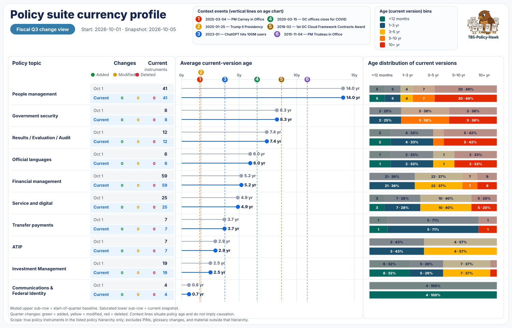
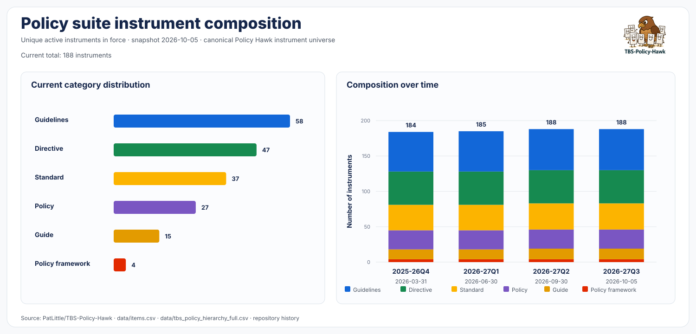

<!-- policy-hawk:banner -->

# Policy Evolution 2026-27 Q3

**Period covered:** 2026-10-01 to 2026-12-31 
**Source:** Auto-analysis comments added to TBS-Policy-Hawk issues.

This file compiles policy-change analysis comments for updates detected during the quarter. Entries are organized chronologically by the effective/update date in the issue GUID.
<!-- policy-hawk:latest-heatmap -->

<!-- policy-hawk:currency-profile:start -->
## Policy suite currency profile

This quarter-level view tracks the **currency and change profile of the policy suite as a whole**. It is intentionally kept separate from the instrument-by-instrument analyses below.

<!-- policy-hawk:currency-profile-synopsis:start -->
### Currency profile synopsis

> **Scope note:** The Policy Suite currency profile includes only true policy instruments in the listed policy hierarchy. It excludes PINs, glossary changes, and anything outside that hierarchy.

The profile contains **188 current policy instruments** across the ten reporting topics. **Financial management** is the largest area with 59 instruments (31.4% of the suite), followed by **People management** with 41 (21.8%) and **Service and digital** with 25 (13.3%). Together, those three areas account for **66.5%** of current instruments. At the other end of the distribution, **Communications & Federal Identity** contains 4 instruments (2.1%).

The age profile differs sharply across topics. **People management** has the oldest current-version population, averaging **14.0 years**; 65.9% of its instruments are at least five years since their current version, including 48.8% at 10+ years. **Government security** also has a comparatively older profile at **8.3 years** on average, with 75.0% at five years or more. By contrast, **Communications & Federal Identity** averages just **0.7 years**, with 100.0% of instruments revised within the last three years; **Investment Management** is also relatively recent at **2.5 years** on average. These are differences in recency of the current versions, not assessments of policy quality or effectiveness.
<!-- policy-hawk:currency-profile-synopsis:end -->

- **Muted upper rows** show the start-of-quarter baseline (2026-10-01).
- **Saturated lower rows** show the current snapshot (2026-10-05).
- Quarter-to-date changes are shown as **added** (green), **modified** (yellow), and **deleted** (red) instruments.
- The lollipop chart compares average current-version age at the baseline and current snapshot.
- The distribution strips group current-version ages into `<12 months`, `1–3 years`, `3–5 years`, `5–10 years`, and `10+ years`.
- Vertical reference lines provide historical context only; they do **not** imply causation.

<!-- policy-hawk:currency-profile:end -->

<!-- policy-hawk:category-history:start -->
## Policy suite instrument composition

This view counts each **unique active policy instrument in force once**, using document ID as the identity key and the instrument's `category` at each reconstructed snapshot. It uses the same canonical Policy Hawk policy-instrument universe as the currency profile and excludes PINs, glossary changes, and non-instrument hierarchy nodes.

As of **2026-10-09**, the suite contains **188 instruments**: **Guidelines 58**, **Directive 47**, **Standard 37**, **Policy 27**, **Guide 15**, **Policy framework 4**.

### Instrument purpose, alignment and audience

Of the **188** instruments, **111 (59.0%) are mandatory** Policies, Directives or Standards; **73 (38.8%) are voluntary** Guidelines or Guides; and **4 (2.1%) are architectural Policy Frameworks**. By usual audience, **31 (16.5%)** are primarily executive/accountability-facing for Ministers and Deputy Heads, while **157 (83.5%)** are primarily implementation-facing for managers and functional specialists.

**Structural shift since 2026-27Q2:** none so far. The mandatory/voluntary balance and usual-audience mix are unchanged from the prior quarter-end snapshot.

> **Interpretation:** Policy Frameworks provide the strategic architecture and explain **why** Treasury Board sets policy in an area; Policies define **what** is expected and are mandatory; Directives and Standards provide mandatory **how** / operational requirements; Guidelines, Guides and Tools provide voluntary implementation guidance. Audience classifications describe the **usual primary audience**, not an exclusive readership.

The stacked bars show the category composition at each quarter-end snapshot available in Policy Hawk; the current quarter uses the latest available snapshot.

Although these are not official instruments in the Policy Suite, Policy Hawk also tracks **513 notices** in its PIN source collections as of **2026-10-09** ([current PIN_sources.md](PIN_sources.md)):

- Policy on Service and Digital Announcements (PSDA): **18**
- Contracting policy notices (CPN): **47**
- Access to Information and Privacy Notices (ATIPN): **24**
- Human Resources Information Notices (HRIN): **412**
- Security Policy Implementation Notice (SPIN): **6**
- Real Property Policy Notices (RPPN): **6**

<!-- policy-hawk:category-history:end -->

---

## 2026-10-01 — Direction on Government of Canada Cyber Security Readiness in the Frontier Artificial Intelligence Era: Security Policy Implementation Notice

**Issue:** [#521](https://github.com/PatLittle/TBS-Policy-Hawk/issues/521) 
**Notice identifier:** SPIN 2026-01 
**Category:** PIN / SPIN 
**GUID:** `pin_spin_ba14ee010f22_added_c118382e9adc_2026-10-01` 
**Change type:** pin added

### Policy change analysis

**Evidence:** The new repository capture is `data/PINs/changes/pin_spin_ba14ee010f22_added_c118382e9adc_2026-10-01/current.md`; `data/PINs/changes/pin_spin_ba14ee010f22_added_c118382e9adc_2026-10-01/previous.md` records no prior capture. The [direct Canada.ca notice](https://www.canada.ca/en/government/system/digital-government/policies-standards/spin/direction-government-canada-cyber-security-readiness-frontier-artificial-intelligence-era.html) returned HTTP 200 on 2026-10-02, with the same title, effective date, action codes and EPM deadline. This is an analysis of a newly captured notice, not a before/after amendment to an older local version.

#### Summary

SPIN 2026-01 took effect October 1, 2026. It reinforces existing Government Security and Service and Digital policy requirements with a phased set of cyber security actions focused first on critical services and resilience against AI-enabled threats. It applies to organizations covered by section 6 of the Policy on Government Security and spans federal networked assets, including on-premises and GC-managed cloud environments.

#### Operational direction

| Area | New direction | Practical effect |
|---|---|---|
| **Prioritization and deadline (IDT-1; 7.1–7.2)** | Rank critical services and their supporting systems; submit the prioritized list in TBS's EPM tool by **November 30, 2026**. Start with no more than three highest-priority services where capacity is limited, then extend the approach to remaining services. | Departments need an agreed critical-service scope and submission plan now; the three-service starting point is a recommended phasing method, not a permanent limit. |
| **Asset and exposure visibility (IDT-2–6)** | Maintain application inventories in APM, architecture diagrams, Internet-connection lists for NCTNS, and SBOMs for department-developed software supporting critical services; onboard endpoints to SSC EVA, prioritizing critical services. | Link service owners, assets, dependencies and external exposure so the most consequential gaps can be found and tracked. |
| **Vulnerabilities and identity (ACC-1–3; HRD-1–8)** | Triage alerts, accelerate risk-based patching for high-risk systems, use defensive AI safely, enforce MFA and least privilege, protect privileged and non-person identities, and update awareness exercises for AI-enabled impersonation. | Security and identity teams need shorter response cycles and explicit ownership for service accounts and AI agents. |
| **Containment and detection (FTY-1–5; MTR-1–3)** | Harden edge and remote access, control vendor access, segment critical systems, default-deny outbound Internet traffic in critical-service environments, protect administrator pathways, centralize tamper-resistant logs, and deploy EDR/XDR. | The notice turns the “assume breach” approach into layered controls that restrict lateral movement and support detection. |
| **Response and recovery (PRP-1–5)** | Align cyber event and business-continuity plans, exercise them, maintain response playbooks, test restores against known-good data, and separate/protect critical-service backups. | Departments should demonstrate that critical services can be contained and recovered, rather than relying on untested plans or backups. |
| **Third parties and oversight (7.3; 8; Appendix A)** | Carry relevant security requirements into contracts and ongoing management. TBS will verify exposed perimeter systems, monitor progress and engage senior officials where direction is unmet; Appendix A provides **notional** indicators. | Outsourcing does not remove departmental responsibility. The indicators guide monitoring and should not be read as additional fixed deadlines. |

#### Interpretation and watch item

The SPIN provides concrete implementation priorities and one explicit EPM submission deadline while leaving underlying policy obligations in force. Apart from November 30, several actions use terms such as “regularly,” “up-to-date,” or “where possible,” so the notice itself does not set a uniform completion date for every control. The detailed control and KPI lists in the captured notice remain the source for implementation planning; this summary does not replace them.

---

<!-- policy-hawk:issue-524:start -->
## 2026-10-05 — Amendments to the Directive on the Management of Real Property – Collection of Public Purpose Interests

**Issue:** [#524](https://github.com/PatLittle/TBS-Policy-Hawk/issues/524) 
**Notice identifier:** RPPN 2026-3 
**Affected document ID:** 32691 
**Category:** PIN / RPPN 
**GUID:** `pin_rppn_b907dc7ddc07_added_0467ac78b48f_2026-10-05` 
**Change type:** pin added

### Policy change analysis

#### Evidence and dates

- **Notice:** [RPPN 2026-3 — Collection of Public Purpose Interests](https://www.canada.ca/en/treasury-board-secretariat/services/federal-real-property-management/real-property-policy-notices/2026-3.html).
- **Current capture:** `data/PINs/changes/pin_rppn_b907dc7ddc07_added_0467ac78b48f_2026-10-05/current.md`.
- **Previous notice evidence:** `data/PINs/changes/pin_rppn_b907dc7ddc07_added_0467ac78b48f_2026-10-05/previous.md` records “No previous capture.” This establishes a newly captured notice, not a proven first publication date.
- **Affected instrument:** Directive on the Management of Real Property (32691), Appendix F. Closest pre-amendment capture: `data/Directive/32691_2026-07-24/20260725T014912Z.md`. The post-amendment text is preserved in [issue #520’s current-version comment](https://github.com/PatLittle/TBS-Policy-Hawk/issues/520#issuecomment-5898127044); the September 29 XML file contains a request-rejection page and is unsuitable for substantive comparison.
- **Notice date and amendment effective date:** September 21, 2026. **Detection/GUID and page-modified date:** October 5, 2026.
- **Live-source check, October 5, 2026:** the direct notice returned HTTP 200 with substantive text matching the capture. The separate directive fetch returned “Request Rejected”; independent live verification of that instrument remains indeterminate.

#### Summary

RPPN 2026-3 explains the September 21 amendment already analyzed in [#520](https://github.com/PatLittle/TBS-Policy-Hawk/issues/520). Departments may collect public-purpose interests sequentially or simultaneously. The notice makes departmental accountability, adherence to the existing priority order for sequential collection, and documentation of the chosen method explicit.

This is implementation direction for a **mandatory Directive**, primarily relevant to real-property practitioners and managers. It does not create a new policy instrument or demonstrate a second amendment in October.

#### Substantive changes and implementation direction

| Area | Evidence before / previous state | Evidence now | Interpretation |
|---|---|---|---|
| **F.2.2 — Collection method** | July 24 capture required simultaneous collection from federal departments, agent Crown corporations, provinces, municipalities and Indigenous groups. | September directive capture allows simultaneous or sequential collection; the notice confirms that choice. | Departments can adapt collection to the transaction. Faster disposal is an intended or possible effect, not a measured outcome. |
| **Sequential collection and F.2.3** | F.2.3 already established acquisition priorities; the amended F.2.2 permits omission of lower-priority interests when disposing for public purpose to a higher-priority group. | The notice expressly requires sequential collection to follow F.2.3’s order of precedence. | The method is discretionary, but priority compliance is not. For other public purposes, the captured order is federal departments, agent Crown corporations, provinces, then municipalities and Indigenous groups at the same tier. F.2.3 separately retains housing-development priority in any order. |
| **Departmental accountability** | No prior local notice exists; the amended F.2.2 itself does not specify how to justify the method selected. | The notice assigns the choice to the department and requires it to reflect the transaction’s circumstances and characteristics. | The department must exercise and support its judgment; the notice does not establish a new TBS approval step. |
| **Rationale and due diligence** | #520 recommended retaining a clear implementation record; that analysis did not identify a new documentation clause in F.2.2. | The notice explicitly directs departments to maintain adequate documentation of why collection is sequential or simultaneous and to complete required due diligence. | Documentation is now explicit in the notice’s operational direction, including for simultaneous collection. The wording presents these responsibilities as continuing; no prior notice supports claiming that the underlying obligation originated here. |

#### Practical effect

1. **Record the choice:** Explain the selected collection method against the characteristics of each transaction. For sequential collection, retain evidence of the priority followed and, where applicable, the condition permitting collection from lower-priority groups to stop.
2. **Use the correct disposal route:** Appendix F concerns disposals not intended to support housing development. The notice does not replace Appendix E’s housing procedures; E.2.2.6 can route housing-suitable property to Appendix F when the intended disposal is not to support housing.
3. **Retain safeguards:** A collection exception is not a general exemption from due diligence or separate Indigenous and official-language consultation obligations. The notice adds no new numerical threshold, reporting deadline or implementation grace period.
4. **Avoid double counting:** Include this newly captured PIN in the Q3 report by its October 5 GUID date, with the September 21 effective date stated. The underlying directive amendment remains the Q2 event analyzed in #520; the PIN is excluded from the instrument composition and currency-profile population.

#### Watch item

Update disposal procedures and decision-record templates to reflect the notice’s explicit rationale-documentation direction. Keep collection of public-purpose interests distinct from any separate duty to consult. The notice does not state that it supersedes another notice, and the absence of a previous capture cannot establish the first publication date.

#### Classification

`pin-update`; `scope-change` — confirms the F.2.2 collection flexibility and conditional lower-priority exception already analyzed in #520, with explicit implementation accountability and documentation direction.

<!-- policy-hawk:issue-524:end -->

---
