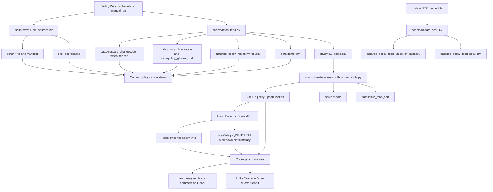

[](https://github.com/PatLittle/TBS-Policy-Hawk/actions/workflows/policy_watch.yml) 

# TBS Policy Hawk

TBS Policy Hawk monitors the Treasury Board of Canada Secretariat Policy Suite for changes, captures policy-source artifacts, and opens GitHub issues when there is something for a policy analyst to review.

The repository tracks four related change surfaces:

1. TBS Policy Suite update feed entries.
2. Policy instrument pages and their archived XML, HTML, Markdown, diff, screenshot, and summary artifacts.
3. Policy hierarchy tree additions and removals.
4. TBS policy glossary and policy implementation notice source changes.

The result is a working evidence trail: machine-readable datasets under `data/`, screenshots under `screenshots/`, GitHub issues for analyst triage, and quarterly `PolicyEvolution{YYYY-YYQ#}.md` reports for completed analysis.

[](https://flatgithub.com/PatLittle/TBS-Policy-Hawk/data/items.csv?filename=data%2Fitems.csv)

## Main Datasets

### `data/items.csv`

This is the historical append-only list of policy update feed items for which the repository downloaded an XML or HTML policy capture. Each row includes the GUID, title, link, category, local filename, and the timestamp when the repository recorded the update.

### `data/new_items.csv`

This is a transient handoff file generated by `scripts/fetch_feed.py` when new reviewable items are found. `scripts/create_issues_with_screenshots.py` reads it to create GitHub issues and screenshots, then maps each item to the created issue in `data/issue_map.json`.

Rows can represent:

- `policy_update`: a new or updated policy instrument found in the TBS update feed.
- `hierarchy_added`: an instrument added to the TBS policy hierarchy tree.
- `hierarchy_removed`: an instrument removed from the hierarchy tree.
- `glossary`: glossary terms changed for a tracked source instrument when no policy update issue already covers that source.

### `data/tbs_policy_feed_union_by_guid.csv`

This is the latest bilingual snapshot of the English and French TBS policy update feeds, unioned by GUID. It is generated by `scripts/update_scd2.py` and is the current-state source for feed-level metadata.

### `data/tbs_policy_feed_scd2.csv`

This is the slowly changing dimension history for feed metadata. `scripts/update_scd2.py` compares each new bilingual snapshot to the current rows, closes changed or deleted records, and inserts new current versions.

### `data/tbs_policy_hierarchy_full.csv`

This is the normalized TBS policy hierarchy tree. It stores document ID, canonical URL, instrument name, minimum hierarchy level, full hierarchy paths, and alternate names. `scripts/fetch_feed.py` refreshes it during the main policy watch run and creates issues when instruments are added or removed.

### `data/policy_glossary.csv` and `data/policy_glossary.md`

These files are generated from the English and French TBS policy glossary pages. The CSV is used for comparison; the Markdown file is a readable grouped reference by source instrument.

### `data/glossary_changes.json`

This temporary metadata file is written only when glossary changes are detected. It groups added, removed, and changed terms by source document ID so issue bodies can include the relevant glossary evidence.

### `PIN_sources.md` and `data/PINs/`

`scripts/sync_pin_sources.py` collects policy implementation notice sources, writes a readable index to `PIN_sources.md`, and stores captured notice content under `data/PINs/`. The manifest at `data/PINs/pin_sources_manifest.json` records the source inventory used for repeatable updates.

### `PolicyEvolution*.md`

These quarterly reports are maintained after issue analysis. They collect the substantive findings posted to GitHub issues, organized by Government of Canada fiscal quarter.

## Main Scripts

### `scripts/fetch_feed.py`

This is the main detection script used by `.github/workflows/policy_watch.yml`.

It:

- reads the TBS latest-changes RSS feed;
- falls back to instrument-specific feeds and then the modifications table if needed;
- downloads newly detected policy documents into `data/{Category}/`;
- updates `data/items.csv` and writes `data/new_items.csv`;
- refreshes the hierarchy CSV and detects hierarchy additions or removals;
- refreshes bilingual glossary data and detects term additions, removals, or definition/source changes;
- writes `data/glossary_changes.json` when glossary changes need to be included in issue bodies.

### `scripts/create_issues_with_screenshots.py`

This script reads `data/new_items.csv`, captures screenshots, creates GitHub issues, applies labels, and updates `data/issue_map.json`.

Issue bodies include the source title, link, category, GUID, screenshot, hierarchy-change context, and glossary-change summaries where available.

### `scripts/enrich_issue.py`

This script runs when a policy-update issue is opened or when `issue_enrich.yml` is dispatched manually for a specific issue. It fetches the policy page as HTML, converts it to Markdown, stores the current capture under `data/{Category}/{GUID}/`, computes a diff against the previous Markdown capture when one exists, captures a screenshot, and posts enrichment comments back to the issue.

If `GEMINI_API_KEY` is available, it also writes and comments an expert summary of the diff.

### `scripts/update_scd2.py`

This script builds a bilingual feed snapshot and maintains `data/tbs_policy_feed_scd2.csv` as a versioned history of feed metadata. It is used by `.github/workflows/update_scd2.yml`.

### `scripts/sync_pin_sources.py`

This script refreshes tracked policy implementation notice sources and their captured Markdown content. It is run inside the main Policy Watch workflow after policy feed detection.

### `scripts/policy_sources.py`

This module contains the shared parsing, normalization, comparison, and serialization logic for hierarchy and glossary sources.

### `scripts/build_tbs_policy_hierarchy.py`

This parser converts the TBS policy hierarchy HTML page into a full CSV representation. It is used by `scripts/policy_sources.py` and by the manual `build-csv.yml` workflow.

### `scripts/init_framework_xml_archive.py`

This is a manual archive bootstrap script used by `.github/workflows/init_xml_archives.yml`. It is not part of the scheduled update path, but remains useful when rebuilding or seeding the XML archive.

## GitHub Actions Workflows

### `.github/workflows/policy_watch.yml`

This is the primary scheduled workflow. It runs three times per day and can also be dispatched manually.

It:

- installs Python dependencies and Playwright;
- runs `scripts/fetch_feed.py`;
- runs `scripts/sync_pin_sources.py`;
- commits dataset, policy capture, glossary, hierarchy, and PIN updates;
- creates issues and screenshots when new reviewable items are found;
- commits screenshot and issue-map artifacts.

### `.github/workflows/issue_enrich.yml`

This workflow enriches individual issues. It runs automatically for newly opened issues and manually with an `issue_number` input. It writes HTML/Markdown/diff/summary artifacts under `data/{Category}/{GUID}/`, updates screenshots, and comments the captured evidence on the issue.

### `.github/workflows/update_scd2.yml`

This scheduled workflow refreshes the bilingual feed snapshot and SCD2 history each day.

### `.github/workflows/build-csv.yml`

This manual workflow rebuilds the hierarchy CSV directly from the hierarchy page. It is retained as a repair or refresh utility even though the scheduled Policy Watch workflow also refreshes hierarchy data.

### `.github/workflows/init_xml_archives.yml`

This manual workflow seeds the XML archive. It is retained for archive initialization or rebuilds, not for daily operations.

## Automation Order And Generated Outputs

The repository separates detection, artifact capture, issue creation, enrichment, and quarterly analysis so each generated output has a clear source.



In short: `policy_watch.yml` detects source changes and opens issues, `issue_enrich.yml` captures detailed page evidence for each issue, Codex performs substantive policy analysis and updates quarterly reports, and `update_scd2.yml` maintains a separate feed-history dataset.

## Issue Types And Analyst Focus

Policy Hawk issues are meant to separate signal from source churn.

- For `policy_update` issues, compare the current captured instrument to the closest prior repository version and identify substantive policy changes.
- For `hierarchy_added` and `hierarchy_removed` issues, explain what changed in the policy suite hierarchy, whether the instrument appears new, renamed, redirected, retired, or moved, and whether the hierarchy path changes affect interpretation of parent/child policy relationships.
- For `glossary` issues, identify added, removed, and changed terms, the source instrument affected, and whether definition changes create terminology, scope, authority, or implementation implications.
- For PIN updates, review newly issued or changed notices, record the notice family, title, issue date, linked instruments, and practical direction or implementation obligations.

Completed analysis is posted to the relevant issue, the `AutoAnalyzed` label is applied, and the finding is added to the appropriate quarterly `PolicyEvolution*.md` report.

## Local Usage

Install dependencies:

```bash
python -m pip install -r requirements.txt
playwright install chromium
```

Run the primary detector locally:

```bash
python scripts/fetch_feed.py
python scripts/sync_pin_sources.py
```

Create issues from detected items:

```bash
GITHUB_REPOSITORY=PatLittle/TBS-Policy-Hawk GITHUB_TOKEN=... python scripts/create_issues_with_screenshots.py
```

Enrich a specific issue:

```bash
GITHUB_REPOSITORY=PatLittle/TBS-Policy-Hawk GITHUB_TOKEN=... ISSUE_NUMBER=123 python scripts/enrich_issue.py
```

Refresh SCD2 history:

```bash
python scripts/update_scd2.py
```

## Notification Options

To receive updates from this repository:

- watch the repository and set notifications to issues; or
- subscribe directly to the TBS Policy Suite RSS feed: <https://www.tbs-sct.canada.ca/pol/rssfeeds-filsrss-eng.aspx?feed=2&count=25>.
